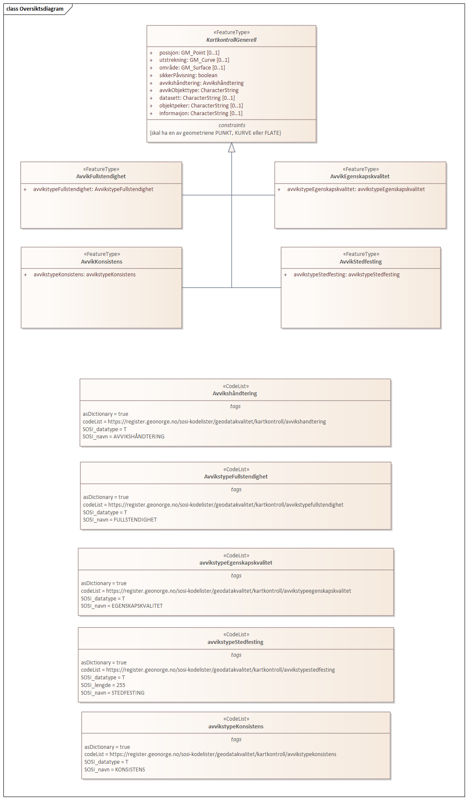
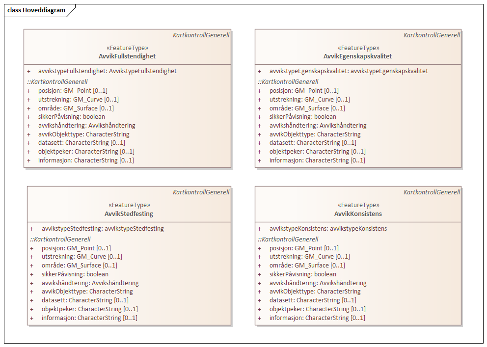

// Start of UML-model
=== Pakke: «ApplicationSchema» Kartkontroll 1.0
*Definisjon:* Datamodell for tilbakemelding på avvik funnet ved kontroll av kartdata i tråd med kvalitetsmodellen i standarden Geodatakvalitet. Benyttes i Geovekst/FKB kartleggingsprosjekter.
 
[discrete]
==== Profilparametre i tagged values
[cols="20,80"]
|===
|definition
|"Contains deviations from control of geodata"@en
 
|description
|"Describes deviations from map control"@en
 
|designation
|"Product spesification Kartkontroll 1.0"@en
 
|language
|no
 
|SOSI_kortnavn
|Kartkontroll
 
|SOSI_langnavn
|Tilbakemelding på avvik ved kontroll av geodata
 
|SOSI_modellstatus
|utkast
 
|SOSI_spesifikasjonstype
|produktspesifikasjon
 
|SOSI_versjon
|5.0
 
|targetNamespace
|http://skjema.geonorge.no/SOSI/produktspesifikasjon/Kartkontroll/1.0
 
|version
|1.0
 
|xmlns
|app
 
|xsdDocument
|Kartkontroll.xsd
 
|xsdEncodingRule
|sosi
 
|===
 
'''
 
.Oversiktsdiagram 

 
'''
 
.Hoveddiagram 

 
'''
 
[[kartkontrollgenerell]]
==== «FeatureType» KartkontrollGenerell (abstrakt)
*Definisjon:* abstrakt objekttype som inneholder felles egenskaper for alle typer tilbakemeldinger på avvik.

Som geometri for avviket benyttes geometrien til objektet som avviket er knyttet til, eller det etableres et punkt som representerer posisjonen til avviket i terrenget.
 
[discrete]
===== Egenskaper
[cols="20,80"]
|===
|*Navn:* 
|*posisjon*
 
|Definisjon: 
|avvikets posisjon.

Punkt-geometri benyttes der avviket er knyttet til et punktobjekt eller der avviket er knyttet til en mangel i dataene (posisjonerer hvor noe mangler).
 
|Multiplisitet: 
|[0..1]
 
|Type: 
|http://skjema.geonorge.no/SOSI/basistype/GM_Point[GM_Point]
|===
[cols="20,80"]
|===
|*Navn:* 
|*utstrekning*
 
|Definisjon: 
|avvikets utstrekning.

Kurve-geometri benyttes der avviket er knyttet til et objekt med Kurve-geometri.
 
|Multiplisitet: 
|[0..1]
 
|Type: 
|http://skjema.geonorge.no/SOSI/basistype/GM_Curve[GM_Curve]
|===
[cols="20,80"]
|===
|*Navn:* 
|*område*
 
|Definisjon: 
|avvikets område.

Flate-geometri benyttes der avviket knyttes til et objekt med flate-geometri.
 
|Multiplisitet: 
|[0..1]
 
|Type: 
|http://skjema.geonorge.no/SOSI/basistype/GM_Surface[GM_Surface]
|===
[cols="20,80"]
|===
|*Navn:* 
|*sikkerPåvisning*
 
|Definisjon: 
|vurdering av om avviket er sikkert påvist
 
|Multiplisitet: 
|[1..1]
 
|Type: 
|http://skjema.geonorge.no/SOSI/basistype/Boolean[Boolean]
|Profilparametre i tagged values: 
|
SOSI_navn: SIKKER_PÅVISNING + 
|===
[cols="20,80"]
|===
|*Navn:* 
|*avvikshåndtering*
 
|Definisjon: 
|hvordan avviket skal håndteres. Det vil i de fleste tilfeller si hvem som har ansvar for å rette avviket.
 
|Multiplisitet: 
|[1..1]
 
|Type: 
|<<avvikshåndtering,«CodeList» Avvikshåndtering>>
|Profilparametre i tagged values: 
|
defaultCodeSpace: https://register.geonorge.no/sosi-kodelister/geodatakvalitet/kartkontroll/avvikshandtering + 
SOSI_datatype: T + 
SOSI_lengde: 30 + 
SOSI_navn: AVVIKSHÅNDTERING + 
|===
[cols="20,80"]
|===
|*Navn:* 
|*avvikObjekttype*
 
|Definisjon: 
|hvilken objekttype avviket gjelder. For veglenke eller andre typer generelle objekttyper brukes i stedet typeveg (eller ev. annen egenskap som beskriver objektet) som beskrivelse.
 
|Multiplisitet: 
|[1..1]
 
|Type: 
|http://skjema.geonorge.no/SOSI/basistype/CharacterString[CharacterString]
|Profilparametre i tagged values: 
|
SOSI_navn: AVVIK_OBJEKTTYPE + 
|===
[cols="20,80"]
|===
|*Navn:* 
|*datasett*
 
|Definisjon: 
|hvilket datasett avviket gjelder
 
|Multiplisitet: 
|[0..1]
 
|Type: 
|http://skjema.geonorge.no/SOSI/basistype/CharacterString[CharacterString]
|Profilparametre i tagged values: 
|
SOSI_navn: DATASETT + 
|===
[cols="20,80"]
|===
|*Navn:* 
|*objektpeker*
 
|Definisjon: 
|referanse til hvilket objekt avviket gjelder der dette er mulig/hensiktsmessig å angi. Bruk lokalid eller ev. annen identifikasjon som identifiserer objektet unikt.
 
|Multiplisitet: 
|[0..1]
 
|Type: 
|http://skjema.geonorge.no/SOSI/basistype/CharacterString[CharacterString]
|Profilparametre i tagged values: 
|
SOSI_navn: OBJEKTPEKER + 
|===
[cols="20,80"]
|===
|*Navn:* 
|*informasjon*
 
|Definisjon: 
|ekstra beskrivende eller forklarende tekst til avviket
 
|Multiplisitet: 
|[0..1]
 
|Type: 
|http://skjema.geonorge.no/SOSI/basistype/CharacterString[CharacterString]
|Profilparametre i tagged values: 
|
SOSI_navn: INFORMASJON + 
|===
 
[discrete]
===== Restriksjoner
[cols="20,80"]
|===
|*Navn:* 
|*skal ha en av geometriene PUNKT, KURVE eller FLATE*
 
|Beskrivelse: 
|inv: (self.område -&gt; size() ) + (self.posisjon -&gt; size() + self.utstrekning -&gt; size() ) = 1
 
|===
 
[discrete]
===== Arv og realiseringer
[cols="20,80"]
|===
|Subtyper:
|<<avvikegenskapskvalitet,«FeatureType» AvvikEgenskapskvalitet>> +
<<avvikfullstendighet,«FeatureType» AvvikFullstendighet>> +
<<avvikstedfesting,«FeatureType» AvvikStedfesting>> +
<<avvikkonsistens,«FeatureType» AvvikKonsistens>> +
|===
 
'''
 
[[avvikfullstendighet]]
==== «FeatureType» AvvikFullstendighet
*Definisjon:* Avvik innenfor kvalitetskategorien Fullstendighet
 
[discrete]
===== Egenskaper
[cols="20,80"]
|===
|*Navn:* 
|*avvikstypeFullstendighet*
 
|Definisjon: 
|angir type avvik innenfor kategorien fullstendighet (manglende objekt/overskytende objekt)
 
|Multiplisitet: 
|[1..1]
 
|Type: 
|<<avvikstypefullstendighet,«CodeList» AvvikstypeFullstendighet>>
|Profilparametre i tagged values: 
|
defaultCodeSpace: https://register.geonorge.no/sosi-kodelister/geodatakvalitet/kartkontroll/avvikstypefullstendighet + 
SOSI_datatype: T + 
SOSI_lengde: 30 + 
SOSI_navn: FULLSTENDIGHET + 
|===
 
[discrete]
===== Arv og realiseringer
[cols="20,80"]
|===
|Supertype: 
|<<kartkontrollgenerell,«FeatureType» KartkontrollGenerell>>
 
|===
 
'''
 
[[avvikegenskapskvalitet]]
==== «FeatureType» AvvikEgenskapskvalitet
*Definisjon:* Avvik innenfor kategorien Egenskapkvalitet
 
[discrete]
===== Egenskaper
[cols="20,80"]
|===
|*Navn:* 
|*avvikstypeEgenskapskvalitet*
 
|Definisjon: 
|angir type avvik innenfor kategorien egenskapskvalitet (feilklassifisering e.l.)
 
|Multiplisitet: 
|[1..1]
 
|Type: 
|<<avvikstypeegenskapskvalitet,«CodeList» AvvikstypeEgenskapskvalitet>>
|Profilparametre i tagged values: 
|
defaultCodeSpace: https://register.geonorge.no/sosi-kodelister/geodatakvalitet/kartkontroll/avvikstypeegenskapskvalitet + 
SOSI_datatype: T + 
SOSI_lengde: 30 + 
SOSI_navn: EGENSKAPSKVALITET + 
|===
 
[discrete]
===== Arv og realiseringer
[cols="20,80"]
|===
|Supertype: 
|<<kartkontrollgenerell,«FeatureType» KartkontrollGenerell>>
 
|===
 
'''
 
[[avvikkonsistens]]
==== «FeatureType» AvvikKonsistens
*Definisjon:* Avvik innenfor kategorien Logisk konsistens
 
[discrete]
===== Egenskaper
[cols="20,80"]
|===
|*Navn:* 
|*avvikstypeKonsistens*
 
|Definisjon: 
|angir type avvik innenfor kategorien Logisk konsistens
 
|Multiplisitet: 
|[1..1]
 
|Type: 
|<<avvikstypekonsistens,«CodeList» AvvikstypeKonsistens>>
|Profilparametre i tagged values: 
|
defaultCodeSpace: https://register.geonorge.no/sosi-kodelister/geodatakvalitet/kartkontroll/avvikstypekonsistens + 
SOSI_datatype: T + 
SOSI_lengde: 30 + 
SOSI_navn: KONSISTENS + 
|===
 
[discrete]
===== Arv og realiseringer
[cols="20,80"]
|===
|Supertype: 
|<<kartkontrollgenerell,«FeatureType» KartkontrollGenerell>>
 
|===
 
'''
 
[[avvikstedfesting]]
==== «FeatureType» AvvikStedfesting
*Definisjon:* Avvik innenfor kategorien Stedfestingsnøyaktighet
 
[discrete]
===== Egenskaper
[cols="20,80"]
|===
|*Navn:* 
|*avvikstypeStedfesting*
 
|Definisjon: 
|angir type avvik innenfor kategorien stedfestingskvalitet
 
|Multiplisitet: 
|[1..1]
 
|Type: 
|<<avvikstypestedfesting,«CodeList» AvvikstypeStedfesting>>
|Profilparametre i tagged values: 
|
defaultCodeSpace: https://register.geonorge.no/sosi-kodelister/geodatakvalitet/kartkontroll/avvikstypestedfesting + 
SOSI_datatype: T + 
SOSI_lengde: 30 + 
SOSI_navn: STEDFESTING + 
|===
 
[discrete]
===== Arv og realiseringer
[cols="20,80"]
|===
|Supertype: 
|<<kartkontrollgenerell,«FeatureType» KartkontrollGenerell>>
 
|===
 
'''
 
[[avvikshåndtering]]
==== «CodeList» Avvikshåndtering
*Definisjon:* kodeliste med verdier som forteller hvordan avviket skal rettes/håndteres.
 
[discrete]
===== Profilparametre i tagged values
[cols="20,80"]
|===
|asDictionary
|true
 
|codeList
|https://register.geonorge.no/sosi-kodelister/geodatakvalitet/kartkontroll/avvikshandtering
 
|SOSI_datatype
|T
 
|SOSI_navn
|AVVIKSHÅNDTERING
 
|===
 
'''
 
[[avvikstypefullstendighet]]
==== «CodeList» AvvikstypeFullstendighet
*Definisjon:* Kodeliste med verdier for forskjellige typer avvik innenfor kategorien Fullstendighet
 
[discrete]
===== Profilparametre i tagged values
[cols="20,80"]
|===
|asDictionary
|true
 
|codeList
|https://register.geonorge.no/sosi-kodelister/geodatakvalitet/kartkontroll/avvikstypefullstendighet
 
|SOSI_datatype
|T
 
|SOSI_navn
|FULLSTENDIGHET
 
|===
 
'''
 
[[avvikstypeegenskapskvalitet]]
==== «CodeList» AvvikstypeEgenskapskvalitet
*Definisjon:* Kodeliste med verdier for forskjellige typer avvik innenfor kategorien Egenskapskvalitet
 
[discrete]
===== Profilparametre i tagged values
[cols="20,80"]
|===
|asDictionary
|true
 
|codeList
|https://register.geonorge.no/sosi-kodelister/geodatakvalitet/kartkontroll/avvikstypeegenskapskvalitet
 
|SOSI_datatype
|T
 
|SOSI_navn
|EGENSKAPSKVALITET
 
|===
 
'''
 
[[avvikstypekonsistens]]
==== «CodeList» AvvikstypeKonsistens
*Definisjon:* Kodeliste med verdier for forskjellige typer avvik innenfor kategorien Logisk konsistens
 
[discrete]
===== Profilparametre i tagged values
[cols="20,80"]
|===
|asDictionary
|true
 
|codeList
|https://register.geonorge.no/sosi-kodelister/geodatakvalitet/kartkontroll/avvikstypekonsistens
 
|SOSI_datatype
|T
 
|SOSI_navn
|KONSISTENS
 
|===
 
'''
 
[[avvikstypestedfesting]]
==== «CodeList» AvvikstypeStedfesting
*Definisjon:* Kodeliste med verdier for forskjellige typer avvik innenfor kategorien Stedfestingskvalitet
 
[discrete]
===== Profilparametre i tagged values
[cols="20,80"]
|===
|asDictionary
|true
 
|codeList
|https://register.geonorge.no/sosi-kodelister/geodatakvalitet/kartkontroll/avvikstypestedfesting
 
|SOSI_datatype
|T
 
|SOSI_lengde
|255
 
|SOSI_navn
|STEDFESTING
 
|===
// End of UML-model
