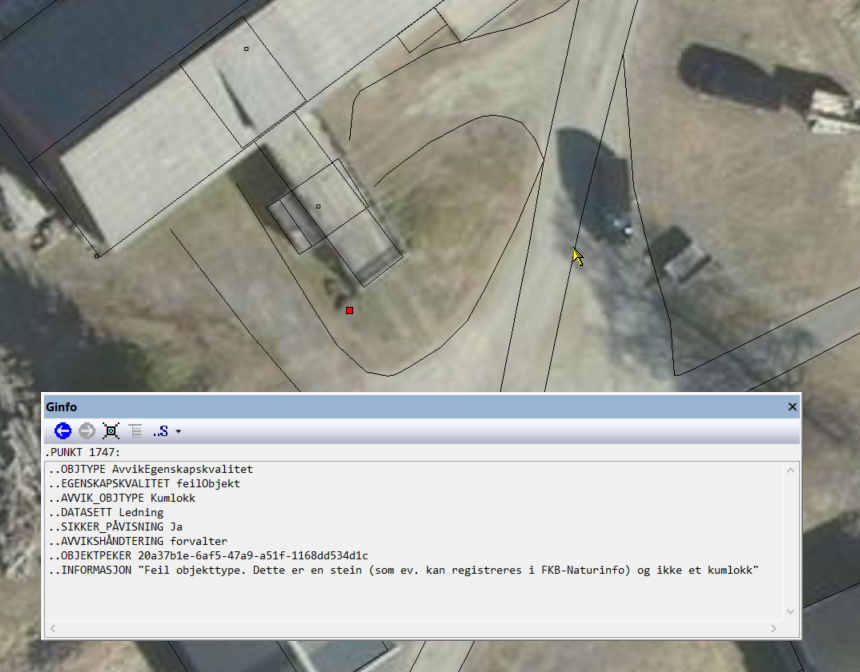

:datasett: AvvikKartdata
:versjon: 1.0
:publisert: 2022-05-19
:skjema-versjon: 1.0

// All informasjon i hode over denne linja må fylles ut for hvert datasett. Linjene under settes av de gitte variablene over og i adoc_parametere.adoc
include::../felles/adoc_parametere.adoc[]
= SOSI produktspesifikasjon: {datasett}
Geovekst
{versjon}, 2022-05-20

include::../felles/dokument_metadata.adoc[]

== Innledning, historikk og endringslogg

=== Innledning

Produktspesifikasjon {datasett} {versjon} spesifiserer hvordan avvik på kartdata kan utveksles. Dette kan brukes både i forbindelse med kunde/leverandør-forhold i ulike typer kartleggingsprosjekter og i forbindelse med samarbeid om datakvalitet mellom ulike parter. 

Produktspesifikasjonen definerer en dokumentert og enhetlig måte å utveklse informasjom om slike avvik på. Produktspesifikasjonen baserer seg på krav til dataene er satt i henhold til rammeverket definert av standarden Geodatakvalitet <<G>>, men kan også brukes til å utveksle andre typer avvik. Se <<Eksempler på koding av avvik etter denne produktspesifikasjonen>> i kapittel 12.1.

Denne produktspesifikasjonen er utarbeidet iht. SOSI produktspesifikasjoner – Krav og godkjenning 5.0 <<SOSI-KRAV>>. UML-modellen som ligger til grunn for innhold i diagrammene og dokumentasjon i kap. 5, følger reglene i SOSI Regler for UML-modellering, versjon 5.1 <<SOSI-UML>>. http://sosi.geonorge.no/veiledere/UML[Denne veilederen] gir hjelp til å lese UML-diagrammene.

=== Historikk

Dette er første versjon av produktspesifikasjonen. I tidligere versjoner av FKB-generell del <<FKB>> har det vært skissert løst hvordan tilbakemeldinger av avvik kan gjøres.

=== Endringslogg

Ingen endringer

=== Normative referanser

include::kap1.4.adoc[]

<<<

== Definisjoner og forkortelser

Denne produktspesifikasjonen baserer seg på definisjoner og forkortelser definert i Geodatakvalitet og FKB. Se http://sosi.geonorge.no/Standarder/FKB_generell_del/#truedefinisjoner-og-forkortelser[kapittel 5 i FKB Generell del 5.0].

<<<

== Generelt om spesifikasjonen

=== Unik identifisering
{datasett}

==== Fullstendig navn
Tilbakemelding på avvik funnet i kartdata

==== Versjon
5.0

=== Referansedato
2022-05-05

=== Ansvarlig organisasjon
Geovekst

=== Språk
nor

=== Hovedtema
Datakvalitet

=== Temakategori
basisData

=== Sammendrag
Inneholder avvik funnet ved kontroll av geodata

=== Formål
Produktspesifikasjonen er laget med tanke på følgende bruksområder:

* Tilbakemelding på avvik fra kunde til leverandør i et kartleggingsprosjekt (F.eks. FKB-kartleggingsprosjekter der Kartverket/Geovekst er oppdragsgiver/kunde og kartleggingsfirma er oppdragstaker/leverandør)
* Utveksling av avvik i kartdata mellom partene i et samarbeid (f.eks. avvik i FKB-, Plan- eller Temadata mellom partene i Norge digitalt)

=== Representasjonsform
vektor

=== Datasettoppløsning
Oppløsningen kommer an på oppløsningen på dataene som kontrolleres. Ved kontroll av FKB-data vil det være naturlig å benytte cm oppløsning i dataene.

=== Utstrekningsinformasjon

include::utstrekning.adoc[]

=== Identifikasjonsomfang
<<HeleDatasettet,Hele datasettet>>

=== Supplerende beskrivelse
Data ikke angitt

<<<

== Spesifikasjonsomfang

(Antall spesifikasjonsomfang: 2)

[[HeleDatasettet]]
=== Spesifikasjonsomfang for hele datasettet

==== Identifikasjon
Hele datasettet

==== Nivå
Datasett

==== Navn
{datasett}

==== Beskrivelse
Hele datasettet

==== Utstrekningsinformasjon

include::utstrekning.adoc[] 

<<<

== Innhold og struktur

=== Omfang
<<HeleDatasettet,Hele datasettet>>

include::kap5.adoc[]

<<<

== Referansesystem

include::kap6.adoc[]

<<<

== Kvalitet

=== Omfang
<<HeleDatasettet,Hele datasettet>>

=== Beskrivelse av datakvalitet
Denne produktspesifikasjonen er laget for å bidra til bedre kvalitet på reelle geodata. Kvaliteten til avvikene som funnet ved kontroll som utveksles ved denne produktspesifikasjonen forutsettes å være god, og ved uenighet om påvisningen av de enkelte avvikene vil dette være noe som må håndteres av oppdragtaker og oppdragsgiver i fellesskap i det enkelte kartleggingsprosjekt.

<<<

== Datafangst

=== Omfang
<<HeleDatasettet,Hele datasettet>>

=== Kontroll av data
Data etter denne produktspesifikasjonen (avvik) vil oppstå ved kontroll/analyse av kartdata. 

I forbindelse med kartleggingsprosjekter utføres en kontroll av dataene mot kravene som er satt til leveransen hos oppdragsgiver. Kravene satt i avtaledokumenter og rammeverket definert i FKB <<FKB>> og Geodatakvalitet <<G>> vil definere hva som er et avvik. I andre sammenhenger kan det gjøres analyser av av dataene mot andre datakilder, eller avvik kan oppdages ved bruk. Denne produktspesifikasjonen gir ikke nærmere informasjon om hvordan slike avvik avdekkes, men kun om hvordan de utveksles. 

<<<

== Datavedlikehold

Ikke relevant

<<<

== Presentasjon

Ikke relevant

<<<

== Leveranse

include::kap11.adoc[]

<<<

== Tilleggsinformasjon

=== Eksempler på koding av avvik etter denne produktspesifikasjonen

.Eksempel på koding ved dokumentert manglende Mønelinje 
image::figurer/fullstendighet_mangler.png[link=figurer/fullstendighet_mangler.png, alt="Viser manglende Mønelinje."]

.Eksempel på koding ved overskytende Veranda 
image::figurer/fullstendighet_overskytende.png[link=figurer/fullstendighet_overskytende.png, alt="Viser overskytende Veranda."]

.Eksempel på koding ved feiltolket objekttype. Stein er feiltolket som kumlokk 

== Metadata

Ikke relevant

<<<

[appendix]
== GML-realisering

GML-realiseringen følger kravene i "Realisering i GML-format 5.0" <<SOSI-GML>>. Realiseringen defineres av følgende filer:

* link:{skjema-url}/{datasett}.xsd[GML-skjema]
* link:{skjema-url}/{datasett}.sch[Schematron-regler til validering av tilleggskrav til datainnhold og -struktur utover det som er definert i GML-skjemafil] (sch-fil)
* link:{skjema-url}/eksempel/[Katalog med eksempelfiler]

[appendix]
== SOSI-format-realisering

SOSI-realiseringen følger kravene i "Realisering i SOSI-format 5.0" <<SOSI-FORMAT>>. Under en utlisting av SOSI-formatrealiseringen:

include::SOSI-realisering.adoc[]

:sectnums!:

<<<

[discrete]
== Lisensvilkår

// Inkluder lisensvilkår
include::../felles/lisensvilkaar.adoc[]
