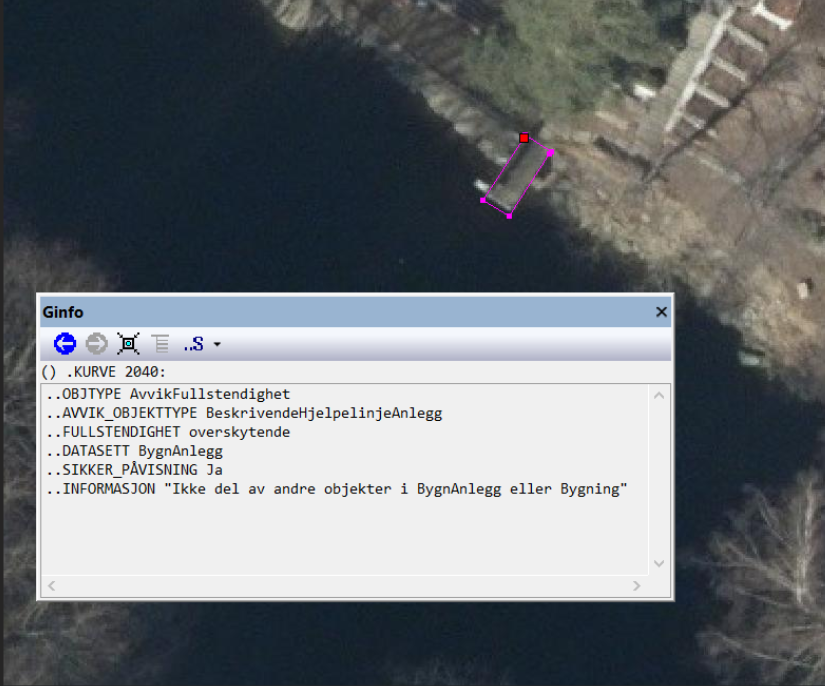

:datasett: AvvikKartdata
:datasett-navn: Avvik kartdata
:versjon: 1.0
:publisert: 2022-08-15
:skjema-versjon: 1.0

// All informasjon i hode over denne linja må fylles ut for hvert datasett. Linjene under settes av de gitte variablene over og i adoc_parametere.adoc
include::../felles/adoc_parametere.adoc[]
= SOSI produktspesifikasjon: {datasett-navn}
Kartverket
{versjon}, 2022-08-15

include::../felles/dokument_metadata.adoc[]

== Innledning, historikk og endringslogg

=== Innledning

Produktspesifikasjon {datasett-navn} {versjon} spesifiserer hvordan avvik på kartdata skal utveksles. Produktspesifikasjonen brukes til å utveksle informasjon om avvik mellom to forskjellige versjoner av samme datasett, eller mellom et bestemt kartdatasett og virkeligheten. Dette kan brukes både i forbindelse med kunde/leverandør-forhold i ulike typer kartleggingsprosjekter og i forbindelse med samarbeid om datakvalitet mellom ulike parter.  

Produktspesifikasjonen definerer en dokumentert og enhetlig måte å utveklse informasjom om slike avvik på. Produktspesifikasjonen baserer seg på krav til dataene er satt i henhold til rammeverket definert av standarden Geodatakvalitet <<G>>, men kan også brukes til å utveksle andre typer avvik. 

Produktspesifikasjonen definerer _ikke_ hva som defineres som et avvik og hvordan slik slik avvik kan avdekkes. Dette defineres i kravene som er satt til dataene i produktspesifikasjoner og/eller annet avtaleverk knyttet til geodataene, som f.eks. FKB produktspesifikasjoner og Geovekst-avtaler for kartlegging og FDV. 

De konkrete bruksområdene til produktspesifikasjonen er i første omgang knyttet til avvik på FKB-data og andre geodata omfattet av Norge digitalt samarbeidet. Se <<Formål>> i kap. 3.8. Se også <<Eksempler på bruk av bruk av spesifikasjonen>> i Vedlegg C.

Denne produktspesifikasjonen er utarbeidet iht. SOSI produktspesifikasjoner – Krav og godkjenning 5.0 <<SOSI-KRAV>>. UML-modellen som ligger til grunn for innhold i diagrammene og dokumentasjon i kap. 5, følger reglene i SOSI Regler for UML-modellering, versjon 5.1 <<SOSI-UML>>. http://sosi.geonorge.no/veiledere/UML[Denne veilederen] gir hjelp til å lese UML-diagrammene.

=== Historikk

Dette er første versjon av produktspesifikasjonen. I tidligere versjoner av FKB-generell del <<FKB>> har det vært skissert løst hvordan tilbakemeldinger av avvik kan gjøres.

Ta kontakt med Kartverket dersom du har innspill til produktspesifikasjonen eller noen av kodelistene benyttet i denne produktspesifikasjonen.

=== Endringslogg

Ingen endringer

=== Normative referanser

include::kap1.4.adoc[]

<<<

== Definisjoner og forkortelser

Produktspesifikasjonen baserer seg på definisjoner og forkortelser slik de er beskrevet i 
http://sosi.geonorge.no/Standarder/FKB_generell_del/#truedefinisjoner-og-forkortelser[FKB generell del 5.0, kapittel 5]

<<<

== Generelt om spesifikasjonen

=== Unik identifisering
{datasett-navn}

==== Fullstendig navn
Tilbakemelding på avvik i kartdata

==== Versjon
{versjon}

=== Referansedato
2022-06-30

=== Ansvarlig organisasjon
Kartverket

=== Språk
nor

=== Hovedtema
Datakvalitet

=== Temakategori
basisData

=== Sammendrag
Inneholder avvik funnet ved kontroll av geodata

=== Formål
Produktspesifikasjonen er laget spesielt med tanke på følgende bruksområder:

* Tilbakemelding på avvik fra kunde til leverandør i et kartleggingsprosjekt (F.eks. FKB-kartleggingsprosjekter der Kartverket/Geovekst er oppdragsgiver/kunde og kartleggingsfirma er oppdragstaker/leverandør)
* Utveksling av avvik i kartdata mellom partene i et samarbeid (f.eks. avvik i FKB-, Plan- eller Temadata mellom partene i Norge digitalt)

=== Representasjonsform
vektor

=== Datasettoppløsning
Oppløsningen kommer an på oppløsningen på dataene som kontrolleres. 

=== Utstrekningsinformasjon

include::utstrekning.adoc[]

=== Identifikasjonsomfang
<<HeleDatasettet,Hele datasettet>>

=== Supplerende beskrivelse
Data ikke angitt

<<<

== Spesifikasjonsomfang

(Antall spesifikasjonsomfang: 1)

[[HeleDatasettet]]
=== Spesifikasjonsomfang for hele datasettet

==== Identifikasjon
Hele datasettet

==== Nivå
Datasett

==== Navn
{datasett}

==== Beskrivelse
Hele datasettet

==== Utstrekningsinformasjon

include::utstrekning.adoc[] 

<<<

== Innhold og struktur

=== Omfang
<<HeleDatasettet,Hele datasettet>>

include::kap5.adoc[]

<<<

== Referansesystem

include::kap6.adoc[]

<<<

== Kvalitet

=== Omfang
<<HeleDatasettet,Hele datasettet>>

=== Beskrivelse av datakvalitet
Denne produktspesifikasjonen er laget for å bidra til bedre kvalitet på kartdata. Kvaliteten til avvikene som funnet ved kontroll som utveksles etter denne produktspesifikasjonen forutsettes å være god, og ved uenighet om påvisningen av de enkelte avvikene vil dette være noe som må håndteres av oppdragtaker (leverandør) og oppdragsgiver (mottaker) i fellesskap i det enkelte sammenhengen.

<<<

== Datafangst

=== Omfang
<<HeleDatasettet,Hele datasettet>>

=== Kontroll av data
Data etter denne produktspesifikasjonen (avvik) vil oppstå ved kontroll/analyse av kartdata. 

I forbindelse med kartleggingsprosjekter utføres en kontroll av dataene mot kravene som er satt til leveransen hos oppdragsgiver. Kravene er satt i avtaledokumenter og rammeverket definert i FKB <<FKB>> og Geodatakvalitet <<G>> vil definere hva som er et avvik. I andre sammenhenger kan det gjøres analyser av av dataene mot andre datakilder, eller avvik kan oppdages ved bruk. Denne produktspesifikasjonen gir ikke nærmere informasjon om hvordan slike avvik avdekkes, men kun om hvordan de utveksles. 

<<<

== Datavedlikehold

Ikke relevant

<<<

== Presentasjon

Ikke relevant

<<<

== Leveranse

include::kap11.adoc[]

<<<

== Tilleggsinformasjon

=== Eksempler på koding av avvik etter denne produktspesifikasjonen

== Metadata

Ikke relevant

<<<

[appendix]
== GML-realisering

GML-realiseringen følger kravene i "Realisering i GML-format 5.0" <<SOSI-GML>>. Realiseringen defineres av følgende filer:

* link:{skjema-url}/Avvikkartdata.xsd[GML-skjema]
* link:{skjema-url}/Avvikkartdata.sch[Schematron-regler til validering av tilleggskrav til datainnhold og -struktur utover det som er definert i GML-skjemafil] (sch-fil)

[appendix]
== SOSI-format-realisering

SOSI-realiseringen følger kravene i "Realisering i SOSI-format 5.0" <<SOSI-FORMAT>>. SOSI-kontroll definisjonsfiler finnes på link:{skjema-url}/SOSI-kontroll/[egen katalog]. Under en utlisting av SOSI-formatrealiseringen:

include::SOSI-realisering.adoc[]

:sectnums!:

[appendix]
== Eksempler på bruk av bruk av spesifikasjonen

=== Eksempler på avvik funnet ved kontroll av FKB-data fra kartleggingsfirma

Eksemplene viser avvik mellom terrenget (flybilder) og FKB-data

.Eksempel på koding ved dokumentert manglende Mønelinje 
image::figurer/fullstendighet_mangler.png[link=figurer/fullstendighet_mangler.png, alt="Viser manglende Mønelinje."]

.Eksempel på koding ved overskytende BeskrivendeHjelpelinjeAnlegg 

.Eksempel på koding ved feiltolket objekttype. Stein er feiltolket som kumlokk 
image::figurer/egenskapskvalitet_feilobjekt.png[link=figurer/egenskapskvalitet_feilobjekt.png, alt="Viser Stein feiltolket som Kumlokk."]

=== Eksempler på avvik funnet ved konsistenskontroll av FKB-data

Eksemplene viser manglende konsistens i kartdataene. Mellom kartobjekter i samme datasett, eller mellom datasett.

.Eksempel på avvik funnet i konsistenskontroll. Takoverbygg inneholder bygningspunkt i FKB-Bygning

.Eksempel på avvik funnet i konsistenskontroll. Bygningspunkt på dyrka mark i AR5

=== Eksempelfiler

Gå til link:{skjema-url}/Eksempel[katalog med eksempelfiler] for å se eksempelfiler på SOSI-format .

<<<

[discrete]
== Lisensvilkår

// Inkluder lisensvilkår
include::../felles/lisensvilkaar.adoc[]
