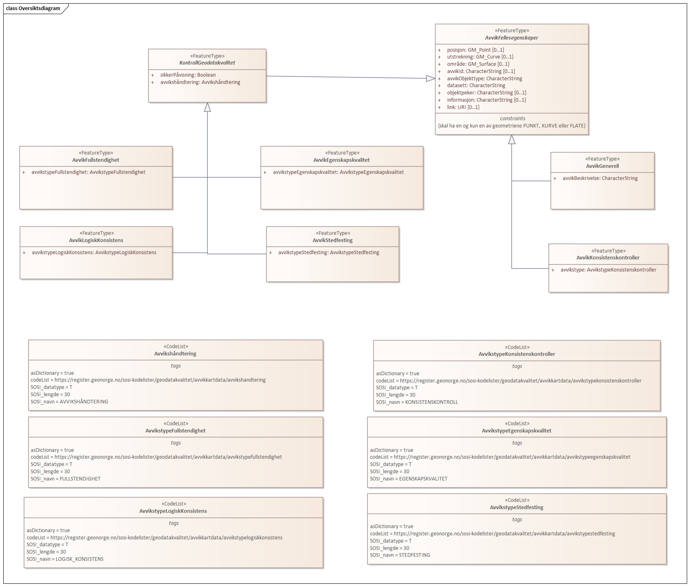
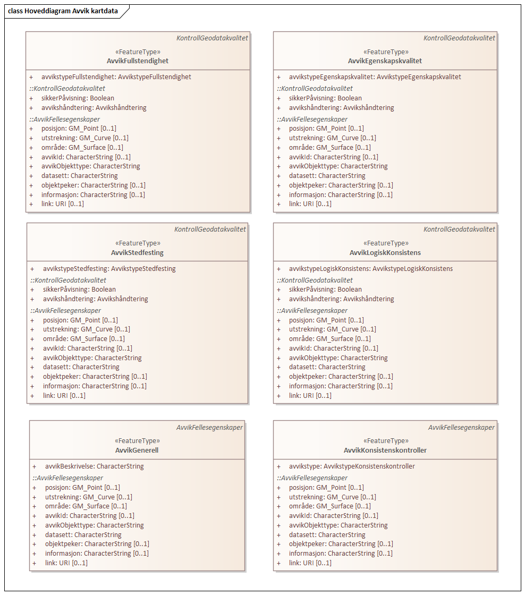

// Start of UML-model
=== Pakke: «ApplicationSchema» Avvik kartdata 1.0
*Definisjon:* Datamodell for tilbakemelding på avvik i kartdata. Omfatter både avvik funnet ved kontroll av kartdata i tråd med kvalitetsmodellen i standarden Geodatakvalitet og andre typer avvik i kartdata. Kan omfatte avvik internt i datasettet, avvik mellom kartdataene og terrenget eller avvik i forhold til et annet datasett. 
Produktspesifkasjonen kan benyttes for utveksling av avvik i kartleggingsprosjekter og i kommunikasjon om datakvalitet mellom ulike parter i et samarbeid - som f.eks. Geovekst.
 
[discrete]
==== Profilparametre i tagged values
[cols="20,80"]
|===
|definition
|"Contains deviations from control of geodata"@en
 
|description
|"Describes deviations on geodata"@en
 
|designation
|"Product spesification Avvik kartdata 1.0"@en
 
|language
|no
 
|SOSI_kortnavn
|AvvikKartdata
 
|SOSI_langnavn
|Tilbakemelding på avvik i kartdata
 
|SOSI_modellstatus
|gyldig
 
|SOSI_spesifikasjonstype
|produktspesifikasjon
 
|SOSI_versjon
|5.0
 
|targetNamespace
|http://skjema.geonorge.no/SOSI/produktspesifikasjon/AvvikKartdata/1.0
 
|version
|1.0
 
|xmlns
|app
 
|xsdDocument
|AvvikKartdata.xsd
 
|xsdEncodingRule
|sosi
 
|===
 
'''
 
.Oversiktsdiagram 

 
'''
 
.Hoveddiagram Avvik kartdata 

 
'''
 
[[avvikfellesegenskaper]]
==== «FeatureType» AvvikFellesegenskaper (abstrakt)
*Definisjon:* abstrakt objekttype som inneholder felles egenskaper for alle typer tilbakemeldinger på avvik.
 
[discrete]
===== Egenskaper
[cols="20,80"]
|===
|*Navn:* 
|*posisjon*
 
|Definisjon: 
|avvikets posisjon.

Der avviket er knyttet til et eksisterende kartobjekt velges et representasjonspunkt for geometrien til dette objektet. Der avviket er knyttet til en mangel i dataene etableres et punkt som viser hvor mangelen er.
 
|Multiplisitet: 
|[0..1]
 
|Type: 
|http://skjema.geonorge.no/SOSI/basistype/GM_Point[GM_Point]
|===
[cols="20,80"]
|===
|*Navn:* 
|*utstrekning*
 
|Definisjon: 
|avvikets utstrekning.

Kurve-geometri benyttes der avviket er knyttet til et objekt med Kurve-geometri.
 
|Multiplisitet: 
|[0..1]
 
|Type: 
|http://skjema.geonorge.no/SOSI/basistype/GM_Curve[GM_Curve]
|===
[cols="20,80"]
|===
|*Navn:* 
|*område*
 
|Definisjon: 
|avvikets område.

Flate-geometri benyttes der avviket knyttes til et objekt med flate-geometri.
 
|Multiplisitet: 
|[0..1]
 
|Type: 
|http://skjema.geonorge.no/SOSI/basistype/GM_Surface[GM_Surface]
|===
[cols="20,80"]
|===
|*Navn:* 
|*avvikId*
 
|Definisjon: 
|Unik identifikasjon av avviket innenfor datasettet i form av et nummer e.l. Unik identifikasjon av det enkelte avvik vil gjøre det lettere å kommunisere om de enkelte avvikene og er spesielt nyttig der avvikene ikke knytter seg til unikt identifiserbare kartobjekter.
 
|Multiplisitet: 
|[0..1]
 
|Type: 
|http://skjema.geonorge.no/SOSI/basistype/CharacterString[CharacterString]
|Profilparametre i tagged values: 
|
SOSI_datatype: T + 
SOSI_lengde: 255 + 
SOSI_navn: AVVIKID + 
|===
[cols="20,80"]
|===
|*Navn:* 
|*avvikObjekttype*
 
|Definisjon: 
|hvilken objekttype avviket gjelder. 
For veglenke eller andre typer generelle objekttyper bør den klassifiserende egenskapen angis i tillegg til objekttypen. F.eks. "Veglenke - sti" eller "Veglenke - enkelBilveg".
 
|Multiplisitet: 
|[1..1]
 
|Type: 
|http://skjema.geonorge.no/SOSI/basistype/CharacterString[CharacterString]
|Profilparametre i tagged values: 
|
SOSI_datatype: T + 
SOSI_lengde: 255 + 
SOSI_navn: AVVIK_OBJEKTTYPE + 
|===
[cols="20,80"]
|===
|*Navn:* 
|*datasett*
 
|Definisjon: 
|hvilket datasett avviket gjelder
 
|Multiplisitet: 
|[1..1]
 
|Type: 
|http://skjema.geonorge.no/SOSI/basistype/CharacterString[CharacterString]
|Profilparametre i tagged values: 
|
SOSI_datatype: T + 
SOSI_lengde: 255 + 
SOSI_navn: DATASETT + 
|===
[cols="20,80"]
|===
|*Navn:* 
|*objektpeker*
 
|Definisjon: 
|referanse til hvilket objekt avviket gjelder der dette er mulig/hensiktsmessig å angi. Bruk lokalid eller ev. annen identifikasjon som identifiserer objektet unikt.
 
|Multiplisitet: 
|[0..1]
 
|Type: 
|http://skjema.geonorge.no/SOSI/basistype/CharacterString[CharacterString]
|Profilparametre i tagged values: 
|
SOSI_datatype: T + 
SOSI_lengde: 255 + 
SOSI_navn: OBJEKTPEKER + 
|===
[cols="20,80"]
|===
|*Navn:* 
|*informasjon*
 
|Definisjon: 
|ekstra beskrivende eller forklarende tekst til avviket
 
|Multiplisitet: 
|[0..1]
 
|Type: 
|http://skjema.geonorge.no/SOSI/basistype/CharacterString[CharacterString]
|Profilparametre i tagged values: 
|
SOSI_datatype: T + 
SOSI_lengde: 255 + 
SOSI_navn: INFORMASJON + 
|===
[cols="20,80"]
|===
|*Navn:* 
|*link*
 
|Definisjon: 
|Link til nettressurs med mer informasjon om avviket
 
|Multiplisitet: 
|[0..1]
 
|Type: 
|http://skjema.geonorge.no/SOSI/basistype/URI[URI]
|Profilparametre i tagged values: 
|
SOSI_datatype: T + 
SOSI_lengde: 255 + 
SOSI_navn: LINK + 
|===
 
[discrete]
===== Restriksjoner
[cols="20,80"]
|===
|*Navn:* 
|*skal ha en og kun en av geometriene PUNKT, KURVE eller FLATE*
 
|Beskrivelse: 
|inv: (self.område  
 
|===
 
[discrete]
===== Arv og realiseringer
[cols="20,80"]
|===
|Subtyper:
|<<avvikgenerell,«FeatureType» AvvikGenerell>> +
<<avvikkonsistenskontroller,«FeatureType» AvvikKonsistenskontroller>> +
<<kontrollgeodatakvalitet,«FeatureType» KontrollGeodatakvalitet>> +
|===
 
'''
 
[[kontrollgeodatakvalitet]]
==== «FeatureType» KontrollGeodatakvalitet (abstrakt)
*Definisjon:* abstrakt objekttype som inneholder felles egenskaper for alle typer tilbakemeldinger på avvik ihht rammeverket som er definert i standarden Geodatakvalitet.
 
[discrete]
===== Egenskaper
[cols="20,80"]
|===
|*Navn:* 
|*sikkerPåvisning*
 
|Definisjon: 
|vurdering av om avviket er sikkert påvist
 
|Multiplisitet: 
|[1..1]
 
|Type: 
|http://skjema.geonorge.no/SOSI/basistype/Boolean[Boolean]
|Profilparametre i tagged values: 
|
SOSI_navn: SIKKER_PÅVISNING + 
|===
[cols="20,80"]
|===
|*Navn:* 
|*avvikshåndtering*
 
|Definisjon: 
|hvordan avviket skal håndteres. Det vil i de fleste tilfeller si hvem som har ansvar for å rette avviket.
 
|Multiplisitet: 
|[1..1]
 
|Type: 
|<<avvikshåndtering,«CodeList» Avvikshåndtering>>
|Profilparametre i tagged values: 
|
defaultCodeSpace: https://register.geonorge.no/sosi-kodelister/geodatakvalitet/avvikkartdata/avvikshandtering + 
SOSI_datatype: T + 
SOSI_lengde: 30 + 
SOSI_navn: AVVIKSHÅNDTERING + 
|===
 
[discrete]
===== Arv og realiseringer
[cols="20,80"]
|===
|Supertype: 
|<<avvikfellesegenskaper,«FeatureType» AvvikFellesegenskaper>>
 
|Subtyper:
|<<avvikstedfesting,«FeatureType» AvvikStedfesting>> +
<<avvikfullstendighet,«FeatureType» AvvikFullstendighet>> +
<<avvikegenskapskvalitet,«FeatureType» AvvikEgenskapskvalitet>> +
<<avviklogiskkonsistens,«FeatureType» AvvikLogiskKonsistens>> +
|===
 
'''
 
[[avvikgenerell]]
==== «FeatureType» AvvikGenerell
*Definisjon:* avvik i kartdataene som ikke lar seg beskrive med en av de andre avvikstypene. Hva avviket går ut på må defineres i egenskapene avvikBeskrivelse og informasjon. 

Dersom mulig bør en av de andre objekttypene som beskriver et avvik mer konkret/detaljert benyttes.
 
[discrete]
===== Egenskaper
[cols="20,80"]
|===
|*Navn:* 
|*avvikBeskrivelse*
 
|Definisjon: 
|Fritekst beskrivelse av type avvik. Kan i tillegg utfylles ved bruk av egenskapen informasjon.
 
|Multiplisitet: 
|[1..1]
 
|Type: 
|http://skjema.geonorge.no/SOSI/basistype/CharacterString[CharacterString]
|Profilparametre i tagged values: 
|
SOSI_datatype: T + 
SOSI_lengde: 255 + 
SOSI_navn: AVVIK_BESKRIVELSE + 
|===
 
[discrete]
===== Arv og realiseringer
[cols="20,80"]
|===
|Supertype: 
|<<avvikfellesegenskaper,«FeatureType» AvvikFellesegenskaper>>
 
|===
 
'''
 
[[avvikkonsistenskontroller]]
==== «FeatureType» AvvikKonsistenskontroller
*Definisjon:* avvik som beskriver manglende samsvar/konsistens mellom ulike objekter i et datasett, eller mellom datasett.

Geometrien for objektet avviket er knyttet til (eller en forenklet utgave av denne) brukes som geometri for avviket. Objektpeker til objektet angis.
 
[discrete]
===== Egenskaper
[cols="20,80"]
|===
|*Navn:* 
|*avvikstype*
 
|Definisjon: 
|egenskap som beskriver hva slags type konsistenskontroll er er kjørt for å finne avviket 
 
|Multiplisitet: 
|[1..1]
 
|Type: 
|<<avvikstypekonsistenskontroller,«CodeList» AvvikstypeKonsistenskontroller>>
|Profilparametre i tagged values: 
|
defaultCodeSpace: https://register.geonorge.no/sosi-kodelister/geodatakvalitet/avvikkartdata/avvikstypekonsistenskontroller + 
SOSI_datatype: T + 
SOSI_lengde: 30 + 
SOSI_navn: KONSISTENSKONTROLL + 
|===
 
[discrete]
===== Arv og realiseringer
[cols="20,80"]
|===
|Supertype: 
|<<avvikfellesegenskaper,«FeatureType» AvvikFellesegenskaper>>
 
|===
 
'''
 
[[avvikfullstendighet]]
==== «FeatureType» AvvikFullstendighet
*Definisjon:* avvik innenfor kvalitetskategorien Fullstendighet.

Ved manglende fullstendighet angis et punkt der det manglende objektet burde finnes for å representere avviket. Ved overfullstendighet brukes det overskytende objektets geometri (eller ev. en forenklet utgave av denne) og det angis objektpeker til objektet.
 
[discrete]
===== Egenskaper
[cols="20,80"]
|===
|*Navn:* 
|*avvikstypeFullstendighet*
 
|Definisjon: 
|angir type avvik innenfor kategorien fullstendighet (manglende objekt/overskytende objekt)
 
|Multiplisitet: 
|[1..1]
 
|Type: 
|<<avvikstypefullstendighet,«CodeList» AvvikstypeFullstendighet>>
|Profilparametre i tagged values: 
|
defaultCodeSpace: https://register.geonorge.no/sosi-kodelister/geodatakvalitet/avvikkartdata/avvikstypefullstendighet + 
SOSI_datatype: T + 
SOSI_lengde: 30 + 
SOSI_navn: FULLSTENDIGHET + 
|===
 
[discrete]
===== Arv og realiseringer
[cols="20,80"]
|===
|Supertype: 
|<<kontrollgeodatakvalitet,«FeatureType» KontrollGeodatakvalitet>>
 
|===
 
'''
 
[[avvikegenskapskvalitet]]
==== «FeatureType» AvvikEgenskapskvalitet
*Definisjon:* avvik innenfor kategorien Egenskapkvalitet.

Geometrien for objektet avviket er knyttet til (eller en forenklet utgave av denne) brukes som geometri for avviket. Objektpeker til objektet angis.
 
[discrete]
===== Egenskaper
[cols="20,80"]
|===
|*Navn:* 
|*avvikstypeEgenskapskvalitet*
 
|Definisjon: 
|angir type avvik innenfor kategorien egenskapskvalitet (feilklassifisering e.l.)
 
|Multiplisitet: 
|[1..1]
 
|Type: 
|<<avvikstypeegenskapskvalitet,«CodeList» AvvikstypeEgenskapskvalitet>>
|Profilparametre i tagged values: 
|
defaultCodeSpace: https://register.geonorge.no/sosi-kodelister/geodatakvalitet/avvikkartdata/avvikstypeegenskapskvalitet + 
SOSI_datatype: T + 
SOSI_lengde: 30 + 
SOSI_navn: EGENSKAPSKVALITET + 
|===
 
[discrete]
===== Arv og realiseringer
[cols="20,80"]
|===
|Supertype: 
|<<kontrollgeodatakvalitet,«FeatureType» KontrollGeodatakvalitet>>
 
|===
 
'''
 
[[avviklogiskkonsistens]]
==== «FeatureType» AvvikLogiskKonsistens
*Definisjon:* avvik innenfor kategorien Logisk konsistens.

Geometrien for objektet avviket er knyttet til (eller en forenklet utgave av denne) brukes som geometri for avviket. Objektpeker til objektet angis.

 
[discrete]
===== Egenskaper
[cols="20,80"]
|===
|*Navn:* 
|*avvikstypeLogiskKonsistens*
 
|Definisjon: 
|angir type avvik innenfor kategorien Logisk konsistens
 
|Multiplisitet: 
|[1..1]
 
|Type: 
|<<avvikstypelogiskkonsistens,«CodeList» AvvikstypeLogiskKonsistens>>
|Profilparametre i tagged values: 
|
defaultCodeSpace: https://register.geonorge.no/sosi-kodelister/geodatakvalitet/avvikkartdata/avvikstypelogiskkonsistens + 
SOSI_datatype: T + 
SOSI_lengde: 30 + 
SOSI_navn: LOGISK_KONSISTENS + 
|===
 
[discrete]
===== Arv og realiseringer
[cols="20,80"]
|===
|Supertype: 
|<<kontrollgeodatakvalitet,«FeatureType» KontrollGeodatakvalitet>>
 
|===
 
'''
 
[[avvikstedfesting]]
==== «FeatureType» AvvikStedfesting
*Definisjon:* avvik innenfor kategorien Stedfestingsnøyaktighet (jf. Geodatakvalitet).

Krav til stedfesting gjøres ved at det stilles krav til maksimalt systematisk avvik, maksimalt tilfeldig avvik og andel grove feil. Ved kontroll av stedfestingsnøyaktighet sammenlignes dataene med en fasit slik at man kan regne ut systematiske og tilfeldige avvik og sammenligne med de gitte kravene. Avvikene i enkeltavvikene i en slik kontroll egner seg ikke for utveksling av avvik etter denne produktspesifikasjonen. Imidlertid kan de enkelte grovfeilene dokumenteres/utveklses ved bruk av denne spesifikasjonen.    

Geometrien for objektet avviket er knyttet til (eller en forenklet utgave av denne) brukes som geometri for avviket. Objektpeker til objektet angis.
 
[discrete]
===== Egenskaper
[cols="20,80"]
|===
|*Navn:* 
|*avvikstypeStedfesting*
 
|Definisjon: 
|angir type avvik innenfor kategorien stedfestingskvalitet
 
|Multiplisitet: 
|[1..1]
 
|Type: 
|<<avvikstypestedfesting,«CodeList» AvvikstypeStedfesting>>
|Profilparametre i tagged values: 
|
defaultCodeSpace: https://register.geonorge.no/sosi-kodelister/geodatakvalitet/avvikkartdata/avvikstypestedfesting + 
SOSI_datatype: T + 
SOSI_lengde: 30 + 
SOSI_navn: STEDFESTING + 
|===
 
[discrete]
===== Arv og realiseringer
[cols="20,80"]
|===
|Supertype: 
|<<kontrollgeodatakvalitet,«FeatureType» KontrollGeodatakvalitet>>
 
|===
 
'''
 
[[avvikshåndtering]]
==== «CodeList» Avvikshåndtering
*Definisjon:* kodeliste med verdier som forteller hvordan avviket skal rettes/håndteres.
 
[discrete]
===== Profilparametre i tagged values
[cols="20,80"]
|===
|asDictionary
|true
 
|codeList
|https://register.geonorge.no/sosi-kodelister/geodatakvalitet/avvikkartdata/avvikshandtering
 
|SOSI_datatype
|T
 
|SOSI_lengde
|30
 
|SOSI_navn
|AVVIKSHÅNDTERING
 
|===
 
'''
 
[[avvikstypefullstendighet]]
==== «CodeList» AvvikstypeFullstendighet
*Definisjon:* kodeliste med verdier for forskjellige typer avvik innenfor kategorien Fullstendighet
 
[discrete]
===== Profilparametre i tagged values
[cols="20,80"]
|===
|asDictionary
|true
 
|codeList
|https://register.geonorge.no/sosi-kodelister/geodatakvalitet/avvikkartdata/avvikstypefullstendighet
 
|SOSI_datatype
|T
 
|SOSI_lengde
|30
 
|SOSI_navn
|FULLSTENDIGHET
 
|===
 
'''
 
[[avvikstypeegenskapskvalitet]]
==== «CodeList» AvvikstypeEgenskapskvalitet
*Definisjon:* kodeliste med verdier for forskjellige typer avvik innenfor kategorien Egenskapskvalitet
 
[discrete]
===== Profilparametre i tagged values
[cols="20,80"]
|===
|asDictionary
|true
 
|codeList
|https://register.geonorge.no/sosi-kodelister/geodatakvalitet/avvikkartdata/avvikstypeegenskapskvalitet
 
|SOSI_datatype
|T
 
|SOSI_lengde
|30
 
|SOSI_navn
|EGENSKAPSKVALITET
 
|===
 
'''
 
[[avvikstypekonsistenskontroller]]
==== «CodeList» AvvikstypeKonsistenskontroller
*Definisjon:* kodeliste med verdier for forskjellige typer avvik funnet ved kjøring av konsistenskontroller mellom ulike kartdata. 
 
[discrete]
===== Profilparametre i tagged values
[cols="20,80"]
|===
|asDictionary
|true
 
|codeList
|https://register.geonorge.no/sosi-kodelister/geodatakvalitet/avvikkartdata/avvikstypekonsistenskontroller
 
|SOSI_datatype
|T
 
|SOSI_lengde
|30
 
|SOSI_navn
|KONSISTENSKONTROLL
 
|===
 
'''
 
[[avvikstypelogiskkonsistens]]
==== «CodeList» AvvikstypeLogiskKonsistens
*Definisjon:* kodeliste med verdier for forskjellige typer avvik innenfor kategorien Logisk konsistens
 
[discrete]
===== Profilparametre i tagged values
[cols="20,80"]
|===
|asDictionary
|true
 
|codeList
|https://register.geonorge.no/sosi-kodelister/geodatakvalitet/avvikkartdata/avvikstypelogiskkonsistens
 
|SOSI_datatype
|T
 
|SOSI_lengde
|30
 
|SOSI_navn
|LOGISK_KONSISTENS
 
|===
 
'''
 
[[avvikstypestedfesting]]
==== «CodeList» AvvikstypeStedfesting
*Definisjon:* kodeliste med verdier for forskjellige typer avvik innenfor kategorien Stedfestingskvalitet
 
[discrete]
===== Profilparametre i tagged values
[cols="20,80"]
|===
|asDictionary
|true
 
|codeList
|https://register.geonorge.no/sosi-kodelister/geodatakvalitet/avvikkartdata/avvikstypestedfesting
 
|SOSI_datatype
|T
 
|SOSI_lengde
|30
 
|SOSI_navn
|STEDFESTING
 
|===
// End of UML-model
