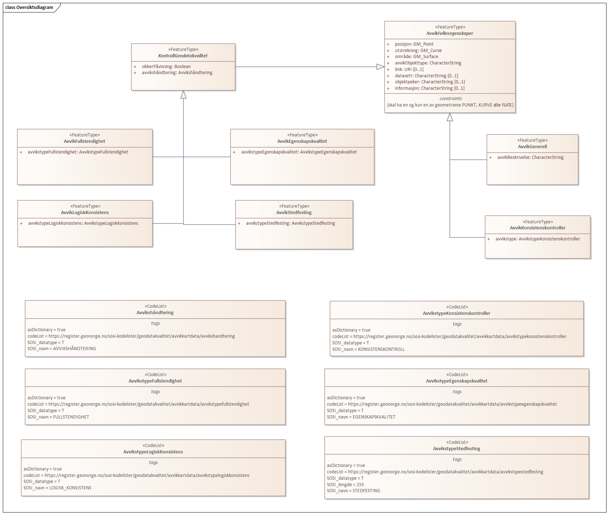

// Start of UML-model
=== Pakke: «ApplicationSchema» AvvikKartdata 1.0
*Definisjon:* Datamodell for tilbakemelding på avvik i Kartdata. Omfatter både avvik funnet ved kontroll av kartdata i tråd med kvalitetsmodellen i standarden Geodatakvalitet og andre typer avvik i kartdata. Kan omfatte avvik internt i datasettet, avvik mellom kartdataene og terrenget eller avvik i forhold til et annet datasett. 
Produktspesifkasjonen kan benyttes for utveksling av avvik i kartleggingsprosjekter og i kommunikasjon om datakvalitet mellom ulike parter i et samarbeid - som f.eks. Geovekst.
 
[discrete]
==== Profilparametre i tagged values
[cols="20,80"]
|===
|definition
|"Contains deviations from control of geodata"@en
 
|description
|"Describes deviations from map control"@en
 
|designation
|"Product spesification Kartkontroll 1.0"@en
 
|language
|no
 
|SOSI_kortnavn
|AvvikKartdata
 
|SOSI_langnavn
|Tilbakemelding på avvik i kartdata
 
|SOSI_modellstatus
|utkast
 
|SOSI_spesifikasjonstype
|produktspesifikasjon
 
|SOSI_versjon
|5.0
 
|targetNamespace
|http://skjema.geonorge.no/SOSI/produktspesifikasjon/AvvikKartdata/1.0
 
|version
|1.0
 
|xmlns
|app
 
|xsdDocument
|AvvikKartdata.xsd
 
|xsdEncodingRule
|sosi
 
|===
 
'''
 
.Oversiktsdiagram 

 
'''
 
.Hoveddiagram 
image::diagrammer/Hoveddiagram.png[link=diagrammer/Hoveddiagram.png, alt="Diagram med navn Hoveddiagram som viser UML-klasser beskrevet i teksten nedenfor."]
 
'''
 
[[avvikgenerell]]
==== «FeatureType» AvvikGenerell (abstrakt)
*Definisjon:* abstrakt objekttype som inneholder felles egenskaper for alle typer tilbakemeldinger på avvik.
 
[discrete]
===== Egenskaper
[cols="20,80"]
|===
|*Navn:* 
|*posisjon*
 
|Definisjon: 
|avvikets posisjon.

Der avviket er knyttet til et eksisterende kartobjekt velges et representasjonspunkt for geometrien til dette objektet. Der avviket er knyttet til en mangel i dataene etableres et punkt som viser hvor mangelen er.
 
|Multiplisitet: 
|[1..1]
 
|Type: 
|http://skjema.geonorge.no/SOSI/basistype/GM_Point[GM_Point]
|===
[cols="20,80"]
|===
|*Navn:* 
|*avvikObjekttype*
 
|Definisjon: 
|hvilken objekttype avviket gjelder. 
For veglenke eller andre typer generelle objekttyper kan det i stedet for objekttype brukes "typeveg" (eller ev. annen egenskap som beskriver objektet).
 
|Multiplisitet: 
|[1..1]
 
|Type: 
|http://skjema.geonorge.no/SOSI/basistype/CharacterString[CharacterString]
|Profilparametre i tagged values: 
|
SOSI_navn: AVVIK_OBJEKTTYPE + 
|===
[cols="20,80"]
|===
|*Navn:* 
|*link*
 
|Definisjon: 
|Link til nettressurs med mer informasjon om avviket
 
|Multiplisitet: 
|[0..1]
 
|Type: 
|http://skjema.geonorge.no/SOSI/basistype/URI[URI]
|Profilparametre i tagged values: 
|
SOSI_datatype: T + 
SOSI_lengde: 255 + 
SOSI_navn: LINK + 
|===
[cols="20,80"]
|===
|*Navn:* 
|*datasett*
 
|Definisjon: 
|hvilket datasett avviket gjelder
 
|Multiplisitet: 
|[0..1]
 
|Type: 
|http://skjema.geonorge.no/SOSI/basistype/CharacterString[CharacterString]
|Profilparametre i tagged values: 
|
SOSI_navn: DATASETT + 
|===
[cols="20,80"]
|===
|*Navn:* 
|*objektpeker*
 
|Definisjon: 
|referanse til hvilket objekt avviket gjelder der dette er mulig/hensiktsmessig å angi. Bruk lokalid eller ev. annen identifikasjon som identifiserer objektet unikt.
 
|Multiplisitet: 
|[0..1]
 
|Type: 
|http://skjema.geonorge.no/SOSI/basistype/CharacterString[CharacterString]
|Profilparametre i tagged values: 
|
SOSI_navn: OBJEKTPEKER + 
|===
[cols="20,80"]
|===
|*Navn:* 
|*informasjon*
 
|Definisjon: 
|ekstra beskrivende eller forklarende tekst til avviket
 
|Multiplisitet: 
|[0..1]
 
|Type: 
|http://skjema.geonorge.no/SOSI/basistype/CharacterString[CharacterString]
|Profilparametre i tagged values: 
|
SOSI_navn: INFORMASJON + 
|===
 
[discrete]
===== Restriksjoner
[cols="20,80"]
|===
|*Navn:* 
|*skal ha en av geometriene PUNKT, KURVE eller FLATE*
 
|Beskrivelse: 
|inv: (self.område -&gt; size() ) + (self.posisjon -&gt; size() + self.utstrekning -&gt; size() ) = 1
 
|===
 
[discrete]
===== Arv og realiseringer
[cols="20,80"]
|===
|Subtyper:
|<<kontrollgeodatakvalitet,«FeatureType» KontrollGeodatakvalitet>> +
<<kartavvik,«FeatureType» KartAvvik>> +
|===
 
'''
 
[[kontrollgeodatakvalitet]]
==== «FeatureType» KontrollGeodatakvalitet (abstrakt)
*Definisjon:* abstrakt objekttype som inneholder felles egenskaper for alle typer tilbakemeldinger på avvik ihht rammeverket som er definert i standarden Geodatakvalitet.
 
[discrete]
===== Egenskaper
[cols="20,80"]
|===
|*Navn:* 
|*sikkerPåvisning*
 
|Definisjon: 
|vurdering av om avviket er sikkert påvist
 
|Multiplisitet: 
|[1..1]
 
|Type: 
|http://skjema.geonorge.no/SOSI/basistype/Boolean[Boolean]
|Profilparametre i tagged values: 
|
SOSI_navn: SIKKER_PÅVISNING + 
|===
[cols="20,80"]
|===
|*Navn:* 
|*avvikshåndtering*
 
|Definisjon: 
|hvordan avviket skal håndteres. Det vil i de fleste tilfeller si hvem som har ansvar for å rette avviket.
 
|Multiplisitet: 
|[1..1]
 
|Type: 
|<<avvikshåndtering,«CodeList» Avvikshåndtering>>
|Profilparametre i tagged values: 
|
defaultCodeSpace: https://register.geonorge.no/sosi-kodelister/geodatakvalitet/kartkontroll/avvikshandtering + 
SOSI_datatype: T + 
SOSI_lengde: 30 + 
SOSI_navn: AVVIKSHÅNDTERING + 
|===
 
[discrete]
===== Arv og realiseringer
[cols="20,80"]
|===
|Supertype: 
|<<avvikgenerell,«FeatureType» AvvikGenerell>>
 
|Subtyper:
|<<avvikstedfesting,«FeatureType» AvvikStedfesting>> +
<<avvikfullstendighet,«FeatureType» AvvikFullstendighet>> +
<<avvikegenskapskvalitet,«FeatureType» AvvikEgenskapskvalitet>> +
<<avvikkonsistens,«FeatureType» AvvikKonsistens>> +
|===
 
'''
 
[[kartavvik]]
==== «FeatureType» KartAvvik
*Definisjon:* avvik i kartdataene som ikke lar seg beskrive med en av de andre avvikstypene. Hva avviket går ut på må defineres i egenskapene avvikstype og informasjon.
 
[discrete]
===== Egenskaper
[cols="20,80"]
|===
|*Navn:* 
|*avvikstype*
 
|Definisjon: 
|Fritekst beskrivelse av type avvik. Kan i tillegg utfylles ved bruk av egenskapen informasjon.
 
|Multiplisitet: 
|[1..1]
 
|Type: 
|http://skjema.geonorge.no/SOSI/basistype/CharacterString[CharacterString]
|Profilparametre i tagged values: 
|
defaultCodeSpace: https://register.geonorge.no/sosi-kodelister/geodatakvalitet/kartkontroll/avvikstypekonsistens + 
SOSI_datatype: T + 
SOSI_lengde: 30 + 
SOSI_navn: KONSISTENS + 
|===
 
[discrete]
===== Arv og realiseringer
[cols="20,80"]
|===
|Supertype: 
|<<avvikgenerell,«FeatureType» AvvikGenerell>>
 
|===
 
'''
 
[[avvikfullstendighet]]
==== «FeatureType» AvvikFullstendighet
*Definisjon:* avvik innenfor kvalitetskategorien Fullstendighet
 
[discrete]
===== Egenskaper
[cols="20,80"]
|===
|*Navn:* 
|*avvikstypeFullstendighet*
 
|Definisjon: 
|angir type avvik innenfor kategorien fullstendighet (manglende objekt/overskytende objekt)
 
|Multiplisitet: 
|[1..1]
 
|Type: 
|<<avvikstypefullstendighet,«CodeList» AvvikstypeFullstendighet>>
|Profilparametre i tagged values: 
|
defaultCodeSpace: https://register.geonorge.no/sosi-kodelister/geodatakvalitet/kartkontroll/avvikstypefullstendighet + 
SOSI_datatype: T + 
SOSI_lengde: 30 + 
SOSI_navn: FULLSTENDIGHET + 
|===
 
[discrete]
===== Arv og realiseringer
[cols="20,80"]
|===
|Supertype: 
|<<kontrollgeodatakvalitet,«FeatureType» KontrollGeodatakvalitet>>
 
|===
 
'''
 
[[avvikegenskapskvalitet]]
==== «FeatureType» AvvikEgenskapskvalitet
*Definisjon:* avvik innenfor kategorien Egenskapkvalitet
 
[discrete]
===== Egenskaper
[cols="20,80"]
|===
|*Navn:* 
|*avvikstypeEgenskapskvalitet*
 
|Definisjon: 
|angir type avvik innenfor kategorien egenskapskvalitet (feilklassifisering e.l.)
 
|Multiplisitet: 
|[1..1]
 
|Type: 
|<<avvikstypeegenskapskvalitet,«CodeList» AvvikstypeEgenskapskvalitet>>
|Profilparametre i tagged values: 
|
defaultCodeSpace: https://register.geonorge.no/sosi-kodelister/geodatakvalitet/kartkontroll/avvikstypeegenskapskvalitet + 
SOSI_datatype: T + 
SOSI_lengde: 30 + 
SOSI_navn: EGENSKAPSKVALITET + 
|===
 
[discrete]
===== Arv og realiseringer
[cols="20,80"]
|===
|Supertype: 
|<<kontrollgeodatakvalitet,«FeatureType» KontrollGeodatakvalitet>>
 
|===
 
'''
 
[[avvikkonsistens]]
==== «FeatureType» AvvikKonsistens
*Definisjon:* avvik innenfor kategorien Logisk konsistens
 
[discrete]
===== Egenskaper
[cols="20,80"]
|===
|*Navn:* 
|*avvikstypeKonsistens*
 
|Definisjon: 
|angir type avvik innenfor kategorien Logisk konsistens
 
|Multiplisitet: 
|[1..1]
 
|Type: 
|<<avvikstypekonsistens,«CodeList» AvvikstypeKonsistens>>
|Profilparametre i tagged values: 
|
defaultCodeSpace: https://register.geonorge.no/sosi-kodelister/geodatakvalitet/kartkontroll/avvikstypekonsistens + 
SOSI_datatype: T + 
SOSI_lengde: 30 + 
SOSI_navn: KONSISTENS + 
|===
 
[discrete]
===== Arv og realiseringer
[cols="20,80"]
|===
|Supertype: 
|<<kontrollgeodatakvalitet,«FeatureType» KontrollGeodatakvalitet>>
 
|===
 
'''
 
[[avvikstedfesting]]
==== «FeatureType» AvvikStedfesting
*Definisjon:* avvik innenfor kategorien Stedfestingsnøyaktighet
 
[discrete]
===== Egenskaper
[cols="20,80"]
|===
|*Navn:* 
|*avvikstypeStedfesting*
 
|Definisjon: 
|angir type avvik innenfor kategorien stedfestingskvalitet
 
|Multiplisitet: 
|[1..1]
 
|Type: 
|<<avvikstypestedfesting,«CodeList» AvvikstypeStedfesting>>
|Profilparametre i tagged values: 
|
defaultCodeSpace: https://register.geonorge.no/sosi-kodelister/geodatakvalitet/kartkontroll/avvikstypestedfesting + 
SOSI_datatype: T + 
SOSI_lengde: 30 + 
SOSI_navn: STEDFESTING + 
|===
 
[discrete]
===== Arv og realiseringer
[cols="20,80"]
|===
|Supertype: 
|<<kontrollgeodatakvalitet,«FeatureType» KontrollGeodatakvalitet>>
 
|===
 
'''
 
[[avvikshåndtering]]
==== «CodeList» Avvikshåndtering
*Definisjon:* kodeliste med verdier som forteller hvordan avviket skal rettes/håndteres.
 
[discrete]
===== Profilparametre i tagged values
[cols="20,80"]
|===
|asDictionary
|true
 
|codeList
|https://register.geonorge.no/sosi-kodelister/geodatakvalitet/kartkontroll/avvikshandtering
 
|SOSI_datatype
|T
 
|SOSI_navn
|AVVIKSHÅNDTERING
 
|===
 
'''
 
[[avvikstypefullstendighet]]
==== «CodeList» AvvikstypeFullstendighet
*Definisjon:* kodeliste med verdier for forskjellige typer avvik innenfor kategorien Fullstendighet
 
[discrete]
===== Profilparametre i tagged values
[cols="20,80"]
|===
|asDictionary
|true
 
|codeList
|https://register.geonorge.no/sosi-kodelister/geodatakvalitet/kartkontroll/avvikstypefullstendighet
 
|SOSI_datatype
|T
 
|SOSI_navn
|FULLSTENDIGHET
 
|===
 
'''
 
[[avvikstypeegenskapskvalitet]]
==== «CodeList» AvvikstypeEgenskapskvalitet
*Definisjon:* kodeliste med verdier for forskjellige typer avvik innenfor kategorien Egenskapskvalitet
 
[discrete]
===== Profilparametre i tagged values
[cols="20,80"]
|===
|asDictionary
|true
 
|codeList
|https://register.geonorge.no/sosi-kodelister/geodatakvalitet/kartkontroll/avvikstypeegenskapskvalitet
 
|SOSI_datatype
|T
 
|SOSI_navn
|EGENSKAPSKVALITET
 
|===
 
'''
 
[[avvikstypekonsistens]]
==== «CodeList» AvvikstypeKonsistens
*Definisjon:* kodeliste med verdier for forskjellige typer avvik innenfor kategorien Logisk konsistens
 
[discrete]
===== Profilparametre i tagged values
[cols="20,80"]
|===
|asDictionary
|true
 
|codeList
|https://register.geonorge.no/sosi-kodelister/geodatakvalitet/kartkontroll/avvikstypekonsistens
 
|SOSI_datatype
|T
 
|SOSI_navn
|KONSISTENS
 
|===
 
'''
 
[[avvikstypestedfesting]]
==== «CodeList» AvvikstypeStedfesting
*Definisjon:* kodeliste med verdier for forskjellige typer avvik innenfor kategorien Stedfestingskvalitet
 
[discrete]
===== Profilparametre i tagged values
[cols="20,80"]
|===
|asDictionary
|true
 
|codeList
|https://register.geonorge.no/sosi-kodelister/geodatakvalitet/kartkontroll/avvikstypestedfesting
 
|SOSI_datatype
|T
 
|SOSI_lengde
|255
 
|SOSI_navn
|STEDFESTING
 
|===
// End of UML-model
